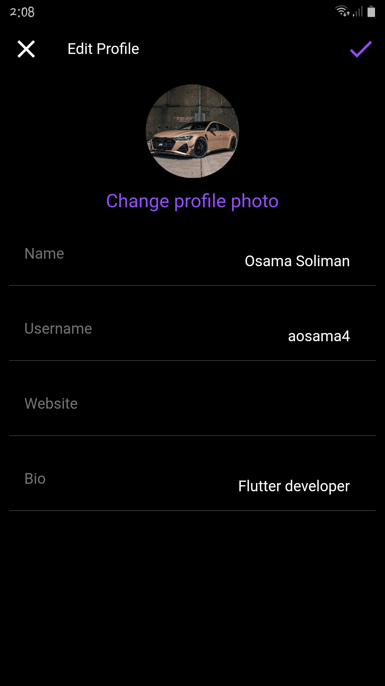

# Instagram Clone : ( Clean architecture with MVVM ).

This project is powered by FLutter and dart.

# Screenshots:

<h3> 1- Auth screen </h3>

<p align="center">
  
  
</p>

<h3> 2- Home screen </h3>

<p align="center">
  
  
</p>

<h3> 3- Story screen </h3>
 
<p align="center">
  
</p>

<h3> 4- Edit post screen </h3>
 
<p align="center">
  
</p>
<h3> 5- Post details screen </h3>
 
<p align="center">
  
</p>
<h3> 6- Comment and Replay screen   </h3>
 
<p align="center">
  
</p>
<h3> 7- Upload Post screen </h3>

<p align="center">
  
  
</p>
<h3> 8- Search screen </h3>

<p align="center">
  
  
</p>
<h3> 9- Chat screen </h3>

<p align="center">
  
  
</p>
<h3> 10- User Profile screen </h3>

<p align="center">
  
  
</p>

<h3> 11- Profile screen and Following Screen </h3>

<p align="center">
  
  
</p>
<h3> 12- Edit Profile screen  </h3>

<p align="center">
  
  
</p>

<h3> 5- Screen Recorder </h3>
<p align="center">
  <video width="320" height="500" autoplay>
  <source src="video.mp4" type="video/mp4">
Your browser does not support the video tag.
</video>

https://drive.google.com/file/d/1iJEDXxnmdwPHrQktWAue2WcfY4_UjuNC/view?usp=sharing

</p>

The main packages used in the project:

```yaml
dependencies:
  cupertino_icons: ^1.0.2
  flutter_bloc: ^8.1.1
  equatable: ^2.0.5
  cloud_firestore: ^4.3.1
  firebase_storage: ^11.0.10
  firebase_auth: ^4.2.4
  firebase_core: ^2.4.1
  get_it: ^7.2.0
  flutter_svg: ^1.1.6
  image_picker: ^0.8.6
  intl: ^0.17.0
  uuid: ^3.0.7
  cached_network_image: ^3.2.3
  fluttertoast: ^8.1.2
  modal_bottom_sheet: ^2.1.2
  toast: ^0.3.0
  icons_plus: ^3.0.0
  story_view: ^0.14.0
dev_dependencies:
  flutter_lints: ^2.0.0
  flutter_launcher_icons: ^0.11.0
```

## How to Use

**Step 1:**

Download or clone this repo by using the link below:

```
https://github.com/osamasabry9/Flutter-Instagram-Clone.git
```

**Step 2:**

Go to project root and execute the following command in console to get the required dependencies:

```
flutter pub get
```

### Folder Structure

Here is the core folder structure which flutter provides.

```
flutter-app/
|- android
|- build
|- ios
|- lib
    |- app/
    |- core/
    |- features/
    |- main
```

Here is the folder structure we have been using in this project

```
lib/app/
       |- app_entity/
       |- app/
       |- di/
lib/core/
       |- widgets/
       |- utils/

lib/features/
       |- User/
       |- Main_screens/
       |- Post/
       |- Story/
       |- Comment/
       |- Replay/
       |- Chat/

 lib/features/User/
       |- data/
       |- domain/
       |- presentation/

data/
       |- data_source/
       |- model/
       |- repository/
domain/
       |- entities/
       |- repository/
       |- usecase/
presentation/
       |- auth/
              |- cubit/
              |- pages/
              |- widgets/
       |- Profile/
                 |- cubit/
                 |- pages/
                 |- widgets/
```
